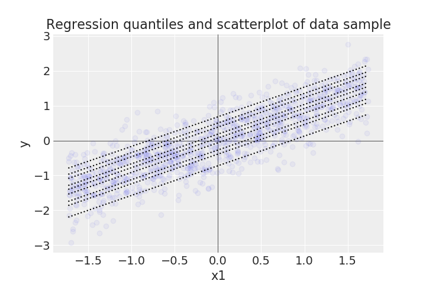
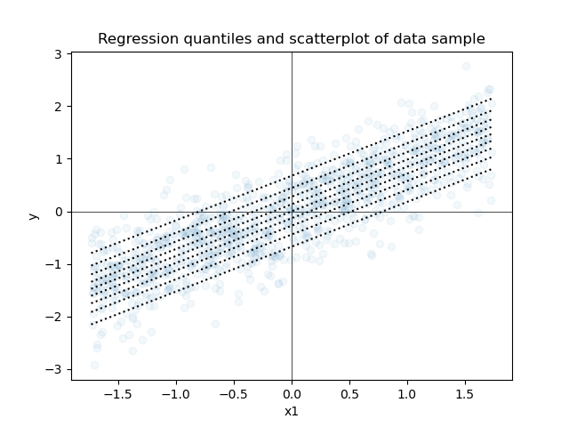
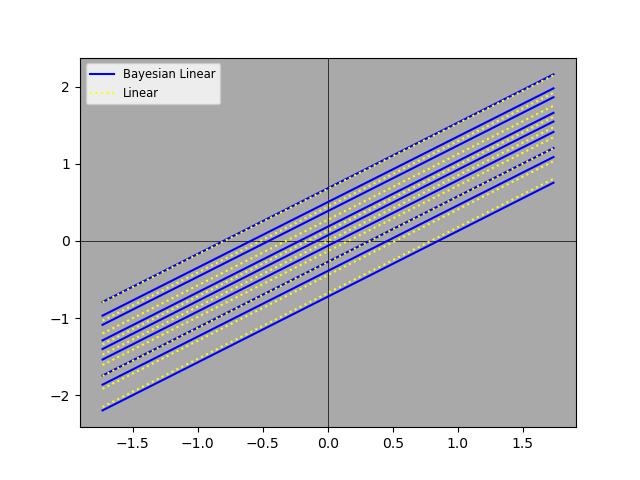
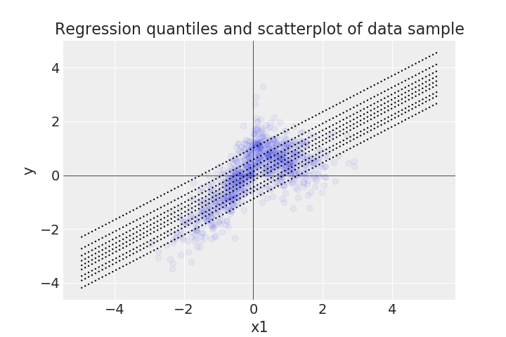
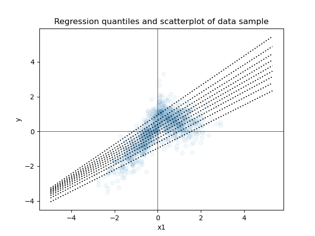
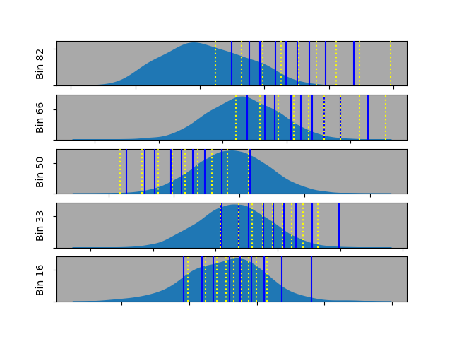
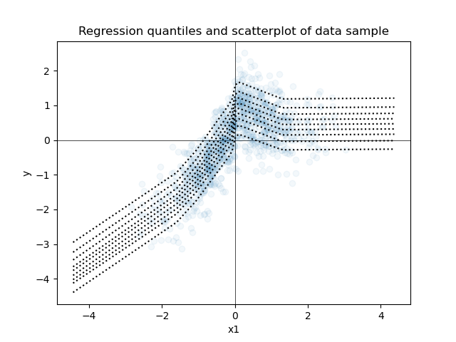
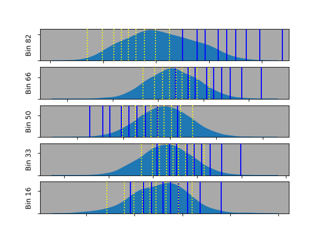

# Beyond Point Estimates

### Ways to get more out of your models

## Full Bayesian vs. Quantile Regression:  Linear Data

When we need our models to produce a full posterior distribution for our 
predictions, we can bring to bear the full suite of tools from [Bayesian 
analysis](http://www.stat.columbia.edu/~gelman/book/).  Sometimes, though, we
need shortcuts:  using the full Bayesian model may exceed our computational
limitations, or we may not have the tooling and infrastructure to readily 
productionize it.  In such cases, [quantile regression](
https://en.wikipedia.org/wiki/Quantile_regression) can be a convenient 
alternative.

Quantile regression lets us predict a chosen [quantile](
https://en.wikipedia.org/wiki/Quantiles) (e.g., the median, the 80th percentile)
of our predicted outcome variable's distribution.  This distribution isn't 
exactly the same as the predicted posterior distribution of a full Bayesian
model, because it doesn't account for a prior.  However, in cases where the
prior is very weak or the large number of cases in our data set lets the 
likelihood overwhelm the prior's effects on the posterior, the predicted 
quantiles can be reasonably close to the corresponding positions of the 
posterior.

To illustrate this similarity, I [generated](
https://github.com/afairless/bayesian_quantile_multitask_nn/blob/main/src/s01_generate_data.py) 
some positively correlated bivariate data with Gaussian noise in the response 
variable, so that I could run some simple regression models on it.  Below is a 
scatterplot of a sample of the data along with every decile (from the 10th to 
the 90th) of the predicted posterior distribution of a [full Bayesian linear 
model](
https://github.com/afairless/bayesian_quantile_multitask_nn/blob/main/src/s03_bayes_stan/bayes_stan.py) 
with [weak priors](
https://github.com/afairless/bayesian_quantile_multitask_nn/blob/main/src/stan_code/s03_bayes_stan.stan) 
on its parameters.

Next is a scatterplot of the same data along with every decile from [quantile
regression models](
https://github.com/afairless/bayesian_quantile_multitask_nn/blob/main/src/s04_quantile.py), 
where each model predicts a single decile.

The two plots appear to be very similar.  We can [juxtapose the Bayesian and
non-Bayesian predictions on a single plot](
https://github.com/afairless/bayesian_quantile_multitask_nn/blob/main/src/s10_results.py), 
so that we can compare them more carefully.

The two sets of predictions aren't identical, but they're quite close.  We can
also look at slices along the x-axis, so that we can see the distributions and
the two sets of predictions.  For this purpose, we [group the data into 100 
bins](https://github.com/afairless/bayesian_quantile_multitask_nn/blob/main/src/s10_results.py)
and show just a few bins along the x-axis.

The density plots show the Gaussian-distributed noise along the y-axis for each
bin.  Accordingly, we can now see the distribution and its predicted deciles
together.

## Full Bayesian vs. Quantile Regression:  Curvy Data

The data for our examples above was generated from a linear model, so the 
Bayesian linear regression and quantile linear regression models readily fit to 
the data very well.  But we often have data that is more complicated, so our 
first attempt at fitting a linear model might not work so well.  Here's an 
example of Bayesian linear regression predictions on a curvier data set.

And here's the quantile regression predictions for the same data.

And here they are superimposed.

Clearly, the linear models are having difficulties.  Noticeably, the quantile
regression models choose slopes so that the predictions of the deciles 
separate, or fan out, as one looks from low x-values (left) to high x-values
(right).  That diverging adjustment might mean that each adjacent pair of 
deciles actually does bound ~10% of the data points overall, but those 
are clearly poor predictions conditional on *x*.  We can see this even more 
clearly below where the Gaussian distributions and the decile predictions 
markedly diverge for several bins.

Of course, this isn't surprising.  If we really want our linear models to fit
non-linear data, we should make them more flexible by, for example, adding
[polynomial terms](https://en.wikipedia.org/wiki/Polynomial_regression) or 
(when we have >1 predictor) [interaction](
https://stattrek.com/multiple-regression/interaction) [terms](
https://quantifyinghealth.com/why-and-when-to-include-interactions-in-a-regression-model/) 
or the like.

An alternative is to use more flexible modeling algorithms like tree ensembles 
or neural networks.  The Python package [scikit-learn](
https://scikit-learn.org/stable/auto_examples/ensemble/plot_gradient_boosting_quantile.html)
has some convenient methods for doing this, but I chose to create my [own
implementation](
https://github.com/afairless/bayesian_quantile_multitask_nn/blob/main/src/s06_multitask_nn.py) 
in [PyTorch](https://pytorch.org/).

While we can continue to [create one model per predicted quantile](
https://github.com/afairless/bayesian_quantile_multitask_nn/blob/main/src/s05_singletask_nn.py), 
it might be more efficient for both training and inference to incorporate all 
the predicted deciles [into a single model](
https://github.com/afairless/bayesian_quantile_multitask_nn/blob/main/src/s06_multitask_nn.py). 
We can do this with [multi-task learning](https://arxiv.org/abs/1706.05098).  

Here are the results from one training run of the model:

Clearly, the more flexible neural network model is adhering more closely to the
deciles condtional on *x*.  We can also see this when we compare the results to
the Bayesian linear regression decile predictions.

While the neural network results aren't perfect, they clearly track the Gaussian
distribution in each x-bin more closely than the linear results do.

## Summary

In summary, we sometimes want more information from our model than just a single
point estimate of the response variable's mean or median; we might want to know
more about the broader range of the prediction.  Bayesian models with 
informative priors are often our best solution, because they can provide us with 
a full posterior predictive distribution.  But they do have their drawbacks, 
including computational intensity.  So a "compromise" solution might be quantile
regression, which we implemented for a linear model and for a more flexible
neural network.

Go [here for the code](
https://github.com/afairless/bayesian_quantile_multitask_nn/tree/main).
